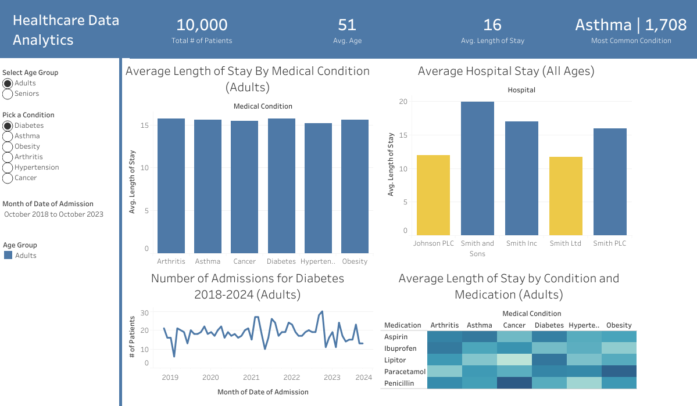

# Healthcare Data Analytics Dashboard

## Project Overview

The Healthcare Data Analytics Dashboard is designed to provide insights into hospital operations, medical conditions, and treatment outcomes. Leveraging a dataset of patient information, this project aims to aid healthcare professionals in making decisions to enhance patient care and operations.

## Features

- **Trends Over Time**

  - **Visualization**: Line graphs showing trends over time, based on the Date of Admission, with filters for different Medical Conditions and Age Groups.
  - **Question Answered**: "How have admission rates for various medical conditions and within different age groups changed over time?"

- **Length of Stay Insights**

  - **Visualization**: Histograms displaying the distribution of Length of Stay by Medical Condition and Age Group.
  - **Question Answered**: "What are the patterns in length of stay across different age groups and medical conditions?"

- **Medication and Treatment Effectiveness**

  - **Visualization**: Heat maps correlating Medical Condition, Medication, and Length of Stay.
  - **Question Answered**: "Which treatments are most effective in reducing the length of stay for various conditions?"

- **Utilization of Hospital Resources**
  - **Visualization**: Bar charts displaying the average length of stay by Hospital.
  - **Question Answered**: "Which hospitals are treating more patients, and how efficiently are they utilizing hospital resources?"

## Data

The dataset includes synthetic patient records with fields such as Name, Age, Gender, Medical Condition, Admission and Discharge Dates, Billing Amount, and more. Recent enhancements to the dataset include the addition of `PatientID`, `Length of Stay`, and `Age Group` fields to provide further granularity for analysis.

## Technologies Used

- **Python**: Used for data preprocessing, cleaning, and initial analysis. The `main.py` file includes scripts for loading the dataset, performing basic manipulations, and preparing the data for visualization.
- **Tableau**: The core of the project, used to create interactive dashboards that allow users to explore various aspects of healthcare data through dynamic visualizations.

## Images

## How to Use the Dashboard

The dashboard is interactive and designed to cater to different user needs:

- Use filters to narrow down the data by time frame, medical condition, or demographic factors.
- Hover over visual elements to get detailed tooltips with additional data points and insights.
- Utilize the "Pick a Condition" and "Select Age Group" parameters to dynamically adjust visualizations and focus on specific areas of interest.

## Getting Started

Visit [here](https://public.tableau.com/app/profile/wilmer.guzman/viz/HealthcareAnalytics_17124357164460/Dashboard1) to use the dashboard.

## Data Used

The dataset consisting of synthetic patient information is available on Kaggle.com [here](https://www.kaggle.com/datasets/prasad22/healthcare-dataset).
